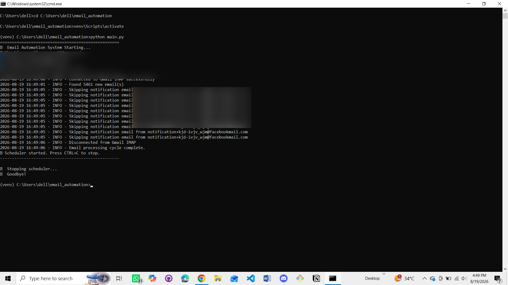
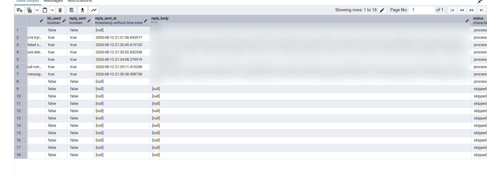
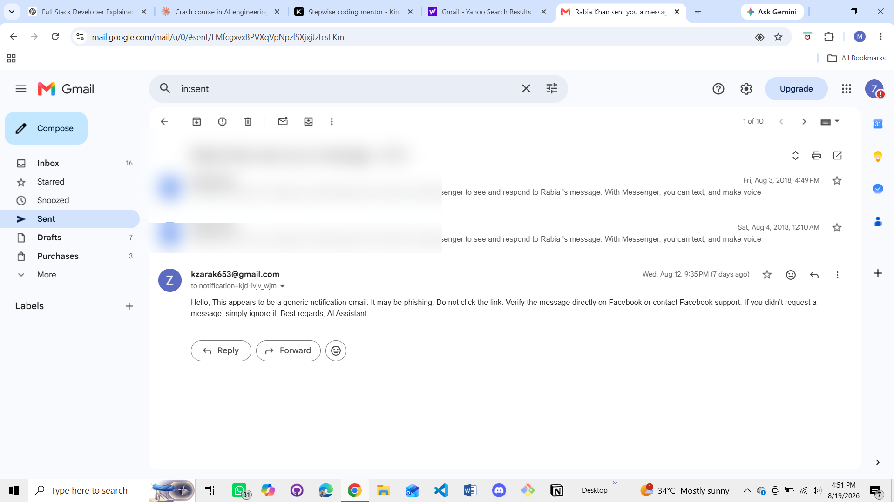

# 🤖 AI Email Intelligence & Response Automation

A Python-based email automation system that monitors a Gmail inbox, analyzes incoming emails with an LLM, generates contextual replies using a local knowledge base, and records the processing workflow in a database.

Built by **Zarak Khan**.

## ✨ What It Does

The system automates the email-processing workflow from inbox to response:

**Gmail → Email Parsing → AI Classification → Priority & Sentiment → Knowledge-Based Reply → Database Logging → Optional SMTP Reply**

## 🚀 Key Features

- 📥 **Automated Email Fetching** using Gmail IMAP
- 🧠 **AI Email Classification** with categories such as support, sales, spam, complaint, job application, invoice, partnership, and urgent action
- 🚦 **Priority Detection** with low, medium, high, and urgent levels
- 😊 **Sentiment Analysis** for positive, neutral, negative, and frustrated tone
- 📝 **Email Summarization & Information Extraction** including sender intent, key facts, action required, and deadlines
- 🧠 **Knowledge-Base Grounded Replies** using local company information, FAQs, and policies
- ✉️ **Automated Reply Generation** through an LLM
- 📤 **Gmail SMTP Integration** for sending replies
- 🗄️ **Database Logging** for email records, AI analysis, generated replies, and workflow events
- ♻️ **Duplicate Detection** to prevent processing the same email twice
- 🔕 **Notification Filtering** for selected social-media and automated notification emails
- 🛡️ **Safety Switch** to prevent real emails from being sent during testing
- ⏰ **Background Scheduling** for repeated inbox polling
- 📝 **File + Console Logging** for monitoring and troubleshooting

## 🧠 AI / LLM Integration

The system uses the **OpenAI Python SDK** with **OpenRouter's API endpoint** to perform two main AI tasks:

1. **Classification** — analyzes an email and returns structured JSON containing category, priority, summary, intent, key facts, action status, deadline, and sentiment.
2. **Response Generation** — combines the original email with the selected analysis and local knowledge-base content to generate a concise, professional reply.

The classifier is instructed to return structured JSON, which the application parses before saving the result to the database.

## 🏗️ Architecture

```text
                    ┌─────────────────┐
                    │   Gmail Inbox   │
                    └────────┬────────┘
                             │ IMAP
                             ▼
                    ┌─────────────────┐
                    │   EmailPoller   │
                    │     Parser      │
                    └────────┬────────┘
                             │
                             ▼
                    ┌─────────────────┐
                    │  AI Classifier  │
                    │  OpenRouter LLM │
                    └────────┬────────┘
                             │
                   category / priority /
                 summary / intent / sentiment
                             │
                             ▼
                    ┌─────────────────┐
                    │  AI Responder   │◄──── Knowledge Base
                    │  OpenRouter LLM │      (.txt / .md)
                    └────────┬────────┘
                             │
                   generated reply
                             │
                 ┌───────────┴───────────┐
                 │                       │
                 ▼                       ▼
        ┌─────────────────┐     ┌─────────────────┐
        │    Database     │     │   SMTP Sender   │
        │ Email + Logs    │     │  Optional Send  │
        └─────────────────┘     └─────────────────┘
```

## 🛠️ Tech Stack

| Category | Technologies |
|---|---|
| **Language** | Python 3.11+ |
| **AI / LLM** | OpenRouter API, OpenAI Python SDK |
| **Email** | Gmail IMAP, Gmail SMTP, email parsing |
| **Database** | PostgreSQL, SQLAlchemy ORM |
| **Scheduling** | APScheduler, background jobs |
| **Configuration** | python-dotenv, environment variables |
| **Data Handling** | JSON parsing, structured JSON output |
| **Logging** | Python logging, file + console logs |
| **Architecture** | Modular Python package structure |
| **Version Control** | Git, GitHub |

## 📁 Project Structure

```text
ai-email-automation/
├── ai/
│   ├── classifier.py
│   ├── responder.py
│   └── knowledge_base.py
├── config/
│   └── settings.py
├── database/
│   ├── db.py
│   └── operations.py
├── email_handler/
│   ├── poller.py
│   └── sender.py
├── knowledge_base/
├── logs/
├── utils/
│   └── logger.py
├── main.py
├── requirements.txt
└── .gitignore
```

## 🔄 Processing Workflow

1. The scheduler triggers the email-processing cycle.
2. The application connects to Gmail through IMAP.
3. New/unseen emails are fetched and parsed.
4. Duplicate messages and selected notification senders are filtered.
5. The AI classifier analyzes the message and returns structured results.
6. The responder loads the local knowledge base and generates a contextual reply.
7. Email data and processing events are stored in the database.
8. The safety switch determines whether a real SMTP reply is sent.
9. The processed email is marked as read and the cycle completes.

## 🔒 Security & Safety

- Secrets are stored in environment variables instead of hard-coded in the application.
- Gmail App Passwords are used for email authentication.
- `.env` is excluded from version control.
- `SEND_REAL_EMAILS = False` provides a safety mode during testing.
- Notification filtering reduces unwanted automated responses.

> **Never upload `.env`, API keys, passwords, or other credentials to GitHub.**

## 🚀 Run Locally

### 1. Clone the repository

```bash
git clone https://github.com/zarak-khan-tech/ai-email-automation.git
cd ai-email-automation
```

### 2. Create a virtual environment

```bash
python -m venv venv
```

On Windows:

```bash
venv\Scripts\activate
```

### 3. Install dependencies

```bash
pip install -r requirements.txt
```

### 4. Configure environment variables

Create a `.env` file and add the required Gmail, OpenRouter, database, and model settings used by the project.

### 5. Start the application

```bash
python main.py
```

The application starts the email-processing service and schedules repeated inbox checks according to the configured polling interval.

## 📸 Screenshots

### Runtime Processing

Shows the automation service running and processing the email workflow from the terminal.



### Database Records

Shows the processed email data and AI analysis stored in PostgreSQL / pgAdmin.



### Automated Email Result

Shows the generated professional reply produced by the automation workflow.



## 📚 Skills Demonstrated

**Python • Object-Oriented Programming • JSON Handling • Error Handling • Environment Variables • Gmail IMAP • Gmail SMTP • Email Parsing • Email Automation • LLM Integration • Prompt Engineering • OpenRouter API • OpenAI Python SDK • AI Classification • Sentiment Analysis • Knowledge-Base Grounding • PostgreSQL • SQLAlchemy ORM • Database Design • CRUD Operations • APScheduler • Background Jobs • Secret Management • Python Logging • Audit Trails • Git • GitHub**

## 🎯 Project Goal

This project was built to demonstrate how **email protocols, AI/LLM integration, database systems, scheduling, and backend automation** can be combined into one practical application.

---

**Built with Python, OpenRouter, PostgreSQL, and Gmail APIs.**